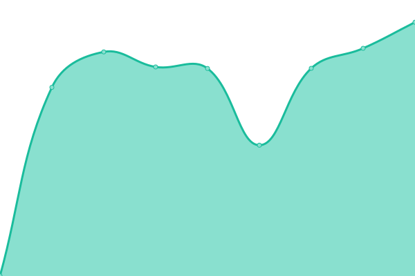
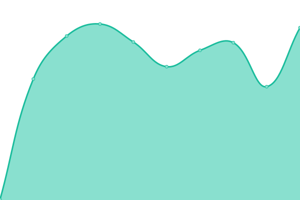

# [📈 Live Status](https://demo.upptime.js.org): <!--live status--> **🟩 All systems operational**

This repository contains the open-source uptime monitor and status page for [Forgotten World](https://forgottenworld.it), powered by [Upptime](https://github.com/upptime/upptime).

With [Upptime](https://upptime.js.org), you can get your own unlimited and free uptime monitor and status page, powered entirely by a GitHub repository. We use [Issues](https://github.com/ForgottenWorld/upptime/issues) as incident reports, [Actions](https://github.com/ForgottenWorld/upptime/actions) as uptime monitors, and [Pages](https://demo.upptime.js.org) for the status page.

<!--start: status pages-->
<!-- This summary is generated by Upptime (https://github.com/upptime/upptime) -->
<!-- Do not edit this manually, your changes will be overwritten -->
<!-- prettier-ignore -->
| URL | Status | History | Response Time | Uptime |
| --- | ------ | ------- | ------------- | ------ |
|  [Forum](https://forum.forgottenworld.it) | 🟩 Up | [forum.yml](https://github.com/ForgottenWorld/upptime/commits/master/history/forum.yml) | 

 572ms
     
 | 

<a href="https://ForgottenWorld.github.io/upptime/history/forum">85.10%</a>
    

|  [Wiki](https://wiki.forgottenworld.it) | 🟩 Up | [wiki.yml](https://github.com/ForgottenWorld/upptime/commits/master/history/wiki.yml) | 

 1302ms
     
 | 

<a href="https://ForgottenWorld.github.io/upptime/history/wiki">84.94%</a>
    

|  [MC server Api](https://fwapi.forgottenworld.it) | 🟩 Up | [mc-server-api.yml](https://github.com/ForgottenWorld/upptime/commits/master/history/mc-server-api.yml) | 

 424ms
     
 | 

<a href="https://ForgottenWorld.github.io/upptime/history/mc-server-api">82.53%</a>
    

|  [Home](https://home.forgottenworld.it) | 🟩 Up | [home.yml](https://github.com/ForgottenWorld/upptime/commits/master/history/home.yml) | 

 137ms
     
 | 

<a href="https://ForgottenWorld.github.io/upptime/history/home">100.00%</a>
    

<!--end: status pages-->

[**Visit our status website →**](https://demo.upptime.js.org)

## 📄 License

- Powered by: [Upptime](https://github.com/upptime/upptime)
- Code: [MIT](./LICENSE) © [Forgotten World](https://forgottenworld.it)
- Data in the `./history` directory: [Open Database License](https://opendatacommons.org/licenses/odbl/1-0/)
